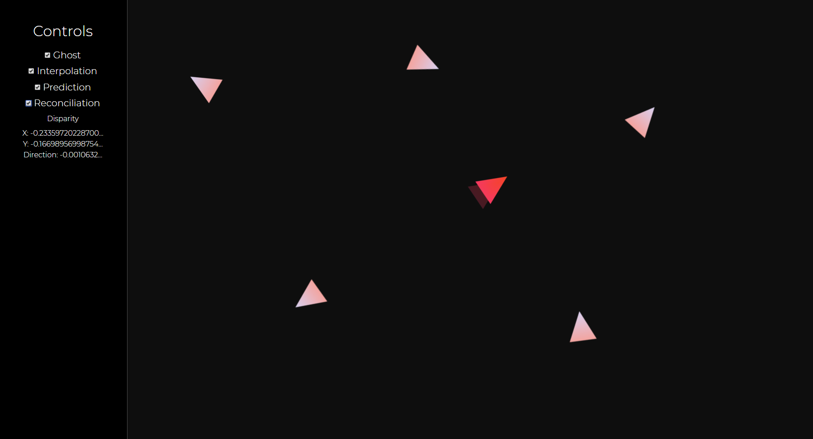

# Multiplayer

This project serves as a sandbox for observing how concepts like interpolation, prediction, and reconciliation contribute to multiplayer networking.

I learned most of the techniques in this project from two sources: the [documentation](https://developer.valvesoftware.com/wiki/Source_Multiplayer_Networking) on Valve's Source Engine, and Gabriel Gambetta's series on [Fast-Paced Multiplayer](http://www.gabrielgambetta.com/client-server-game-architecture.html).

The implementations are not perfect so feel free to clone the project, play around, and improve on it. :)

